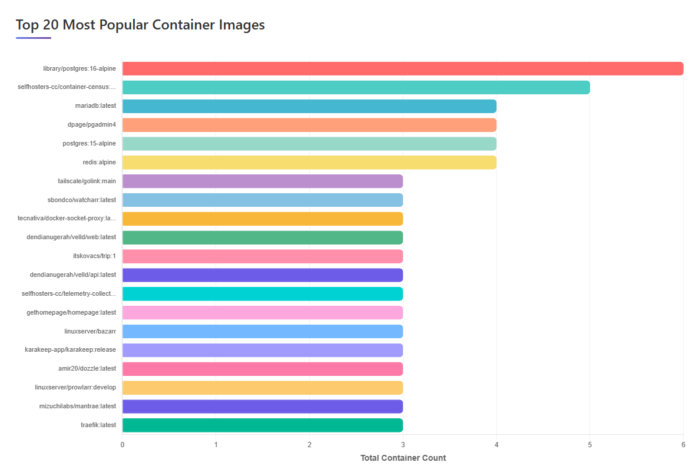

# Container Census
[Changelog](CHANGELOG.md)
### Discover. Visualize. Track. Compare.

**Container Census** is a lightweight, Go-powered tool that automatically scans your Docker environment across one or many hosts and gives you a clear, historical view of everything running in your stack.

Community stats on container usage can be found here: [Selfhosters Stats](https://selfhosters.cc/stats)

##### View / Manage Containers


##### Visualize relationships / networks / links / dependencies


##### View History of Container


##### Manage / Prune Images


##### Manage Multipe Hosts with Agents


##### Manage Telemetry Collection
Can enable public collection ([Selfhosters Stats](https://selfhosters.cc/stats)) or send telemetry information to your own private collector.


#### Want deeper insights?
##### Graph view
See how your containers are connected to each other via networks, dependencies, and links.

##### Multiple Hosts? No problem!
Run lightweight agents on remote hosts to feed data back to your private Telemetry Collector, or choose to anonymously share usage stats with the Selfhosters community to see what’s trending across thousands of self-hosted environments worldwide.

##### Privacy First
Anonymous telemetry is opt-in only and can be enabled anytime from the Settings page.

### Key Features

1. **Multi-Host Scanning** – Monitor every Docker host from one unified dashboard
1. **Lightweight Remote Agents** – Secure, zero-config connectivity between hosts
1. **Simple Web Setup** – Add new hosts with just an IP and token
1. **Automatic Discovery** – Background scans every few minutes (default: 5)
1. **CPU & Memory Monitoring** – Real-time resource usage tracking with historical trends
1. **Historical Insights** – Track what's running, when, and where
1. **Modern Web UI** – Responsive interface with live updates
1. **Full REST API** – Query all container and host data programmatically
1. **Prometheus Metrics** – Export metrics for Grafana and monitoring tools
1. **Container Control** – Start, stop, restart, remove containers, and view logs
1. **Image Management** – List, remove, or prune images across hosts
1. **Single-Container Deployment** – Everything you need in one small footprint (agents and aggregated stats available in separate containers)
1. **Flexible Connectivity** – Agent (recommended), Unix socket, TCP, or SSH
1. **Community / Private Telemetry (Optional)** – Discover popular and trending images worldwide

# Quick Start With Docker Compose

### Server (required)
```
  census-server:
    image: ghcr.io/selfhosters-cc/container-census:latest
    container_name: census-server
    restart: unless-stopped
    group_add:
      - "${DOCKER_GID:-999}"

    ports:
      - "8080:8080"

    volumes:
      # Docker socket for scanning local containers
      - /var/run/docker.sock:/var/run/docker.sock

      # Persistent data directory
      - ./census/server:/app/data

      # Optional: Mount custom config file
      # Uncomment to use a custom configuration
      - ./census/config:/app/config

    environment:
      # Optional: Override config path
      # CONFIG_PATH: /app/config/config.yaml
      AUTH_ENABLED: false
      AUTH_USERNAME: your_username
      AUTH_PASSWORD: your_secure_password
      # Timezone
      TZ: ${TZ:-UTC}

    healthcheck:
      test: ["CMD", "wget", "--no-verbose", "--tries=1", "--spider", "http://localhost:8080/api/health"]
      interval: 30s
      timeout: 3s
      retries: 3
      start_period: 10s
```

### Agent to collect data from other hosts
```
  census-agent:
    image: ghcr.io/selfhosters-cc/census-agent:latest
    container_name: census-agent
    restart: unless-stopped

    # Runtime Docker socket GID configuration
    group_add:
      - "${DOCKER_GID:-999}"

    ports:
      - "9876:9876"

    volumes:
      # Docker socket for local container management
      - /var/run/docker.sock:/var/run/docker.sock

      # Optional: Persistent data directory for API token
      # Only needed if NOT using API_TOKEN environment variable
      # - ./census/agent:/app/data

    environment:
      # API Token (choose one method):
      # Method 1: Set via environment variable (recommended - no volume needed)
      API_TOKEN: ${AGENT_API_TOKEN:-your-secure-token-here}

      # Method 2: Leave empty to auto-generate and persist to volume
      # Requires mounting ./census/agent:/app/data volume above

      PORT: 9876
      TZ: ${TZ:-UTC}

    healthcheck:
      test: ["CMD", "wget", "--no-verbose", "--tries=1", "--spider", "http://localhost:9876/health"]
      interval: 30s
      timeout: 3s
      retries: 3
      start_period: 5s

```

#### Agent Configuration

**API Token - Choose Your Method:**

The agent supports multiple ways to configure the API token, in priority order:

1. **Environment Variable (Recommended)** - Set `API_TOKEN` environment variable
   - No volume mount needed
   - Perfect for Kubernetes, Docker Swarm, or managed container platforms
   - Token persists as long as the environment variable is set
   - Example: `API_TOKEN=your-secure-token-here`

2. **File Persistence** - Mount volume at `/app/data`
   - Token auto-generated on first startup
   - Persisted to `/app/data/agent-token`
   - Survives container restarts and upgrades
   - Useful when you want the agent to manage its own token

3. **Command-line Flag** - Pass `--token` flag when running the container
   - Example: `./census-agent --token=your-token`

4. **Auto-generate (Ephemeral)** - No volume, no env var
   - New token generated on each restart
   - Requires updating the census server UI after each restart
   - Not recommended for production

**Get the API token:**

   ```bash
   # If using auto-generated token (method 2 or 4)
   docker logs census-agent | grep "API Token"

   # If using environment variable (method 1)
   echo $AGENT_API_TOKEN
   ```

**Add agent in the Census Server UI:**
   - Click **"+ Add Agent Host"** button
   - Enter host name, agent URL (`http://host-ip:9876`), and token
   - Click **"Test Connection"** then **"Add Agent"**

---
### Telemetry & Analytics
Container Census includes an optional telemetry system to track anonymous container usage statistics. This helps understand trends and allows you to monitor your own infrastructure.




#### Key Features

1. **Anonymous data collection** - No personal information collected
1. **Multi-endpoint support** - Send to public and/or private analytics servers
1. **Self-hosted analytics** - Run your own telemetry collector
1. **Visual dashboards** - Charts showing popular images, growth trends
1. **Opt-in by default** - Disabled unless explicitly enabled
1. **Server aggregation** - Server collects stats from all agents before submission

#### Run Your Own Analytics Server
```
  telemetry-collector:
    image: ghcr.io/selfhosters-cc/telemetry-collector:latest
    container_name: telemetry-collector
    restart: unless-stopped

    ports:
      - "8081:8081"

    environment:
      DATABASE_URL: postgres://${POSTGRES_USER:-postgres}:${POSTGRES_PASSWORD:-postgres}@telemetry-postgres:5432/telemetry?sslmode=disable
      PORT: 8081
      #API_KEY: ${TELEMETRY_API_KEY:-}
      TZ: ${TZ:-UTC}
      COLLECTOR_AUTH_ENABLED: true
      COLLECTOR_AUTH_USERNAME: collector_user
      COLLECTOR_AUTH_PASSWORD: collector_secure_password

    depends_on:
      telemetry-postgres:
        condition: service_healthy

    healthcheck:
      test: ["CMD", "wget", "--no-verbose", "--tries=1", "--spider", "http://localhost:8081/health"]
      interval: 30s
      timeout: 3s
      retries: 3
      start_period: 10s

  telemetry-postgres:
    image: postgres:15-alpine
    container_name: telemetry-postgres
    restart: unless-stopped

    environment:
      POSTGRES_DB: telemetry
      POSTGRES_USER: ${POSTGRES_USER:-postgres}
      POSTGRES_PASSWORD: ${POSTGRES_PASSWORD:-postgres}
      PGDATA: /var/lib/postgresql/data/pgdata

    volumes:
      - ./telemetry-db:/var/lib/postgresql/data

    healthcheck:
      test: ["CMD-SHELL", "pg_isready -U postgres"]
      interval: 10s
      timeout: 5s
      retries: 5

```

```bash
# Access dashboard
open http://localhost:8081
```

## CPU & Memory Monitoring

Container Census includes comprehensive resource monitoring with historical trending capabilities:

### Features

- **Real-time Stats Collection** - CPU and memory usage collected during each scan
- **Per-Host Configuration** - Enable/disable stats collection for each host individually
- **Two-tier Data Retention**:
  - Granular data: All scans kept for 1 hour
  - Aggregated data: Hourly averages kept for 2 weeks
- **Interactive Charts** - View trends over 1h, 24h, 7d, or all time
- **Sparkline Previews** - Quick glance at trends in the monitoring grid
- **Prometheus Metrics** - Export to Grafana and other monitoring tools
- **All Connection Types** - Works with local socket, agents, TCP, and SSH

### Configuration

**Enable stats collection per host:**
1. Navigate to the **Hosts** tab
2. Click on the stats badge for any host to toggle collection
3. Stats collection begins on the next scan

**Adjust scan interval:**
1. Navigate to the **Settings** tab
2. Select desired interval (1-15 minutes)
3. Click **Save Interval**

**Note:** Stats collection adds minimal overhead but can be disabled for low-resource hosts.

### Viewing Stats

**Monitoring Tab:**
- Grid view of all running containers with stats enabled
- Mini sparkline charts showing recent CPU and memory trends
- Quick summary of current usage
- Filter to show only containers from enabled hosts

**Detailed Stats Modal:**
- Click **View Detailed Stats** on any container
- Select time range: 1 hour, 24 hours, 7 days, or all time
- Dual-axis charts with CPU % and Memory MB
- Average, minimum, and maximum values displayed

## API Endpoints for the Server

### Hosts

- `GET /api/hosts` - List all configured hosts
- `GET /api/hosts/{id}` - Get specific host details

### Containers

- `GET /api/containers` - Get latest containers from all hosts
- `GET /api/containers/host/{id}` - Get containers for specific host
- `GET /api/containers/history?start=TIME&end=TIME` - Get historical container data

### Resource Monitoring

- `GET /api/containers/{host_id}/{container_id}/stats?range={1h|24h|7d|all}` - Get container stats history
- `GET /api/metrics` - Prometheus-formatted metrics endpoint

### Configuration

- `GET /api/config` - Get current configuration including scanner interval
- `POST /api/config/scanner` - Update scanner interval (JSON: `{"interval_seconds": 300}`)

### Scanning

- `POST /api/scan` - Trigger a manual scan
- `GET /api/scan/results?limit=N` - Get recent scan results

### Health

- `GET /api/health` - Health check endpoint

## Development

### Building Images

Use the interactive `build-all-images.sh` script in the scripts folder.

### Project Structure

- `cmd/server/main.go` - Server application entry point
- `cmd/agent/main.go` - Agent application entry point
- `internal/scanner/` - Docker host connection and container discovery
- `internal/agent/` - Agent server implementation
- `internal/storage/` - SQLite database operations with full CRUD
- `internal/api/` - HTTP handlers and routing
- `internal/models/` - Data structures shared across packages
- `web/` - Static frontend files served by the Go application
- `scripts/` - Utility scripts for building and deployment

### Adding New Features

1. Update models in `internal/models/models.go`
2. Add database operations in `internal/storage/db.go`
3. Implement API handlers in `internal/api/handlers.go`
4. Update frontend in `web/` directory


## Troubleshooting

### Cannot connect to Docker daemon

- Ensure Docker socket is mounted: `-v /var/run/docker.sock:/var/run/docker.sock`
- Check socket permissions
- Verify Docker is running on the host
- Ensure DOCKER_GID is set accurately.  Defaults to 999. Confirm value on your system with `stat -c '%g' /var/run/docker.sock` and set the value in your compose file

### Permission denied

- The container runs as non-root user (UID 1000)
- Ensure mounted volumes have correct permissions
- For Docker socket, user needs to be in `docker` group on host

### Remote host connection fails

- Verify network connectivity
- Check firewall rules
- For TCP: Ensure Docker API is exposed on remote host

### Database errors

- Ensure data directory is writable
- Check disk space
- Verify SQLite3 is properly compiled (CGO_ENABLED=1)

## License

MIT License - see LICENSE file for details

## Contributing

Contributions are welcome! Please feel free to submit a Pull Request.

1. Fork the repository
2. Create your feature branch (`git checkout -b feature/amazing-feature`)
3. Commit your changes (`git commit -m 'Add amazing feature'`)
4. Push to the branch (`git push origin feature/amazing-feature`)
5. Open a Pull Request
